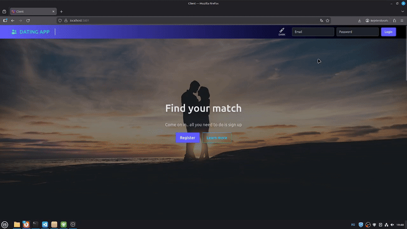

# DatingApp - AI-Powered Smart Dating Platform

This project is a feature-rich, full-stack web application built with a **.NET 9** backend and an **Angular 20** frontend.

It goes beyond standard CRUD applications by implementing a **RAG (Retrieval-Augmented Generation)** architecture. It uses a Vector Database to enable semantic matchmaking, allowing users to find matches based on meaning and context rather than just keyword matching.

**Live Demo:** [https://dating-2025.azurewebsites.net/](https://dating-2025.azurewebsites.net/)
*(Note: The free-tier Azure App Service may experience a cold start, leading to a slower initial load time.)*

## Application Preview


_Member listing with filtering options._


_Home page_

## 🧠 AI & RAG Features (New)

This application implements a modern **AI Engineer stack** within a Clean Architecture:

* **Semantic Matchmaking (RAG):**
    * Users can search for matches using natural language (e.g., *"Someone who loves hiking and outdoor adventures in Budapest"*).
    * **How it works:** User profiles are vectorized (converted to mathematical embeddings) using **Google Gemini** models and stored in a **Qdrant** Vector Database.
    * The system performs a cosine similarity search to find profiles that match the *intent* and *meaning* of the search query, not just exact keywords.
* **AI-Powered Chat Suggestions:**
    * Integrates **Google Gemini** to analyze conversation context and suggest ice-breakers or replies to keep the conversation flowing.
* **Hybrid Data Handling:**
    * Synchronizes structured data (SQL Server) with unstructured semantic data (Qdrant) automatically using database seeders and domain services.

## Key Features

* **User Authentication & Profile Management:** Secure user registration and login using JWT (JSON Web Token) authentication with ASP.NET Core Identity.
* **Real-time Presence & Messaging:** Built with **SignalR** for live online status updates and instant private messaging.
* **Geolocation-based Filtering:** Filters users by physical distance using **NetTopologySuite** (spatial SQL queries) and **OpenCage Geocoding API**.
* **Photo Management:** Cloud-based image storage and transformation using **Cloudinary**.
* **Admin & Moderation:** Dedicated interface for managing roles and approving/rejecting user photos.
* **Advanced Filtering:** Sort and filter by age, gender, created date, and last active timestamp.

## Technology Stack

The solution follows **Clean Architecture** principles, enforcing a strict separation of concerns (Domain, Application, Infrastructure, Presentation) and using the latest .NET standards.

### Backend (.NET 9)

* **Framework:** ASP.NET Core Web API
* **AI & Vectors:**
    * **Microsoft.Extensions.AI:** The latest standard for AI integration in .NET.
    * **Vector Database:** **Qdrant** (running in Docker/Cloud) for storing high-dimensional embeddings.
    * **LLM Integration:** Google Gemini API (for embeddings and chat generation).
* **Database:** SQL Server (with Entity Framework Core).
* **Spatial Data:** NetTopologySuite.
* **Real-time:** SignalR.
* **Testing/Architecture:** Dependency Injection, Repository Pattern, Unit of Work.

### Frontend (Angular 21)

* **Framework:** Angular (latest version).
* **State Management:** Angular Signals.
* **Styling:** Tailwind CSS + DaisyUI.
* **Communication:** HTTP Client & SignalR Client.

## Local Development Setup

To run the AI features locally, you need a running Qdrant instance.

1.  **Start Infrastructure:**
    ```bash
    docker compose up -d
    ```
    This starts the SQL Server and Qdrant Vector DB containers.

2.  **Configuration:**
    Ensure your `appsettings.json` contains valid API keys for Cloudinary, OpenCage, and Google Gemini.

3.  **Run Backend:**
    ```bash
    dotnet watch run --project DatingApp.Presentation
    ```
    *On startup, the Database Seeder will automatically vectorize seed users and upload them to Qdrant.*
## Project Goal

The primary goal of this project is to serve as a practical case study on integrating modern AI technologies into a robust, enterprise-grade .NET application. It demonstrates how to enhance a traditional full-stack application with cutting-edge features like Retrieval-Augmented Generation (RAG), vector search, and LLM-driven interactions, all while strictly adhering to Clean Architecture principles.

The project explores pragmatic solutions for bridging the gap between structured relational data and unstructured semantic data, showcasing a modern approach to building intelligent, feature-rich applications.
