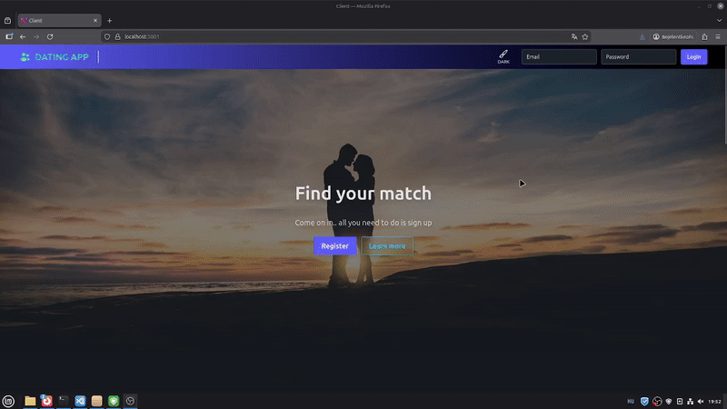

# DatingApp - AI-Powered Smart Dating Platform

This project is a high-performance, full-stack web application developed with a **.NET 10** backend and an **Angular 21** frontend.

It serves as a comprehensive case study in building modern, AI-integrated enterprise software. Beyond standard CRUD operations, it implements a **Hybrid RAG (Retrieval-Augmented Generation)** architecture, showcasing how to bridge the gap between structured relational data (SQL Server) and unstructured semantic data (Vector Databases).

**Live Demo:** [https://dating-2025.azurewebsites.net/](https://dating-2025.azurewebsites.net/)
_(Note: The free-tier Azure App Service may experience a cold start.)_

## Application Preview


_Member listing with filtering options._

## 🧠 AI & Hybrid RAG Architecture

The project demonstrates a production-ready **AI Engineer stack** integrated within a Clean Architecture (4-project structure):

1.  **Semantic Matchmaking**
    - **Vectorization:** User profiles are transformed into high-dimensional vectors. While the initial version used local ONNX models, the system was refactored to use the **Hugging Face Inference API**.
    - **The Model:** Uses the **all-mpnet-base-v2** model ($768$ dimensions). This choice provides superior semantic accuracy compared to smaller models while maintaining a serverless, lightweight backend footprint.
    - **Vector Database:** Embeddings are stored in **Qdrant**. The system performs Cosine Similarity searches to match users based on the "intent" of their descriptions rather than simple keywords.

2.  **Cerebras-Powered Chat Intelligence**
    - **Near-Zero Latency:** Integration with **Cerebras Systems** (via `gpt-oss-120b`) ensures near-instant AI responses.
    - **Intelligent Advice:** The Chat Assistant uses **Microsoft.Agents.AI** to provide context-aware ice-breakers and dating advice based on chat history.

3.  **Dual-Store Synchronization (SQL + Qdrant)**
    - The application maintains state consistency between SQL Server (structured user data) and Qdrant (semantic data).
    - **Automatic Sync:** A robust synchronization logic is implemented during the database seeding process, ensuring that the vector space is always a reflection of the relational database.

## 🌍 Geospatial Intelligence & Proximity Search

Beyond AI matching, the platform implements high-precision location-based filtering to ensure relevant local connections:

- **Spatial Data Processing:** Integrates **NetTopologySuite** to handle complex GIS (Geographic Information System) data. User locations are stored as `Point` types using the **SQL Server Geography** data type.
- **Automated Geocoding:** Leverages the **OpenCage API** to convert plain-text city and country data into precise GPS coordinates during user registration and profile updates.
- **Performant Proximity Filtering:** Uses specialized spatial indexing in SQL Server to perform distance-based queries (e.g., "Find matches within 50km") with near-zero latency, avoiding expensive row-by-row calculations.
- **GeoJSON Integration:** Custom JSON converters ensure seamless communication between the .NET backend and the Angular frontend by following the standard **GeoJSON** format.

## 🛠 Technology Stack

### Backend (.NET 10)

- **Architecture:** Clean Architecture with clear separation of concerns.
- **Standardized AI:** Built using **Microsoft.Extensions.AI** (MS Agent Framework) for provider-agnostic AI integration.
- **Spatial Intelligence:** Uses **NetTopologySuite** for physical distance calculations and **OpenCage API** for geocoding.
- **Security:** JWT-based authentication with ASP.NET Core Identity.
- **Real-time:** **SignalR** for presence tracking and instant messaging.

### Frontend (Angular 21)

- **State Management:** Leveraging the latest **Angular Signals** for reactive and efficient UI updates.
- **Modern Styling:** Built with **Tailwind CSS** and **DaisyUI** for a clean, responsive user experience.
- **Image Handling:** **Cloudinary** integration for optimized cloud-based image transformations.

## 🚀 Local Development Setup

1.  **Infrastructure (Docker)**
    Ensure Docker Desktop is running. Start the vector database:

    ```bash
    docker compose up -d qdrant
    ```

2.  **Configuration**
    Update `appsettings.Development.json` with your API keys:

    ```json
    {
      "HuggingFace": {
        "ApiKey": "your_hf_token",
        "ModelId": "sentence-transformers/all-mpnet-base-v2"
      },
      "CerebrasSettings": {
        "ApiKey": "your_cerebras_key"
      },
      "ConnectionStrings": {
        "DefaultConnection": "Server=YOUR_SERVER;Database=datingdb;Trusted_Connection=True;"
      }
    }
    ```

3.  **Run Application**

    ```bash
    # Run Backend
    cd DatingApp.Presentation && dotnet run

    # Run Frontend (in a separate terminal)
    cd client && npm start
    ```

## Project Purpose

This repository is designed to demonstrate proficiency in:

- Integrating Generative AI and Vector Search into enterprise workflows.
- Implementing Clean Architecture in a .NET 10 environment.
- Managing complex infrastructure (Docker, Azure, Vector DBs).
- Building high-performance, reactive UIs with the latest Angular features.
